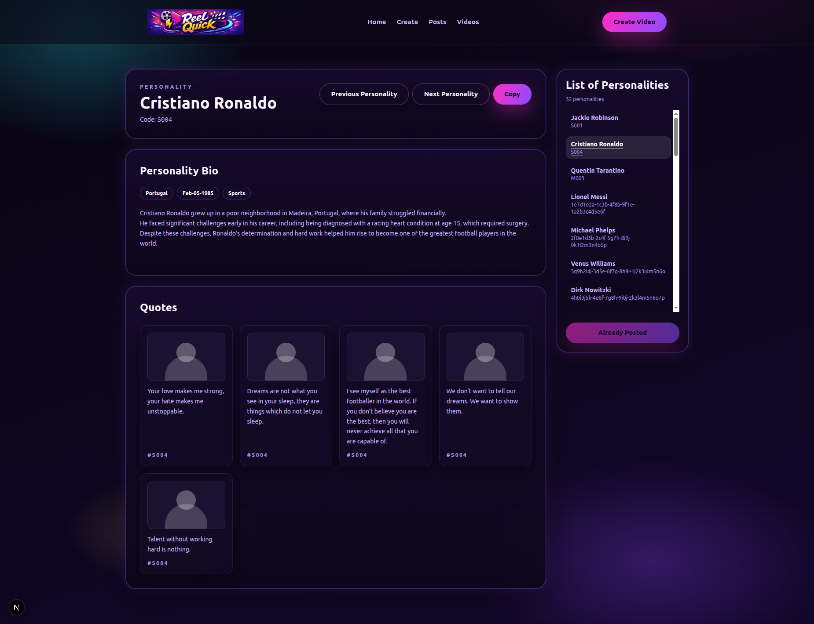
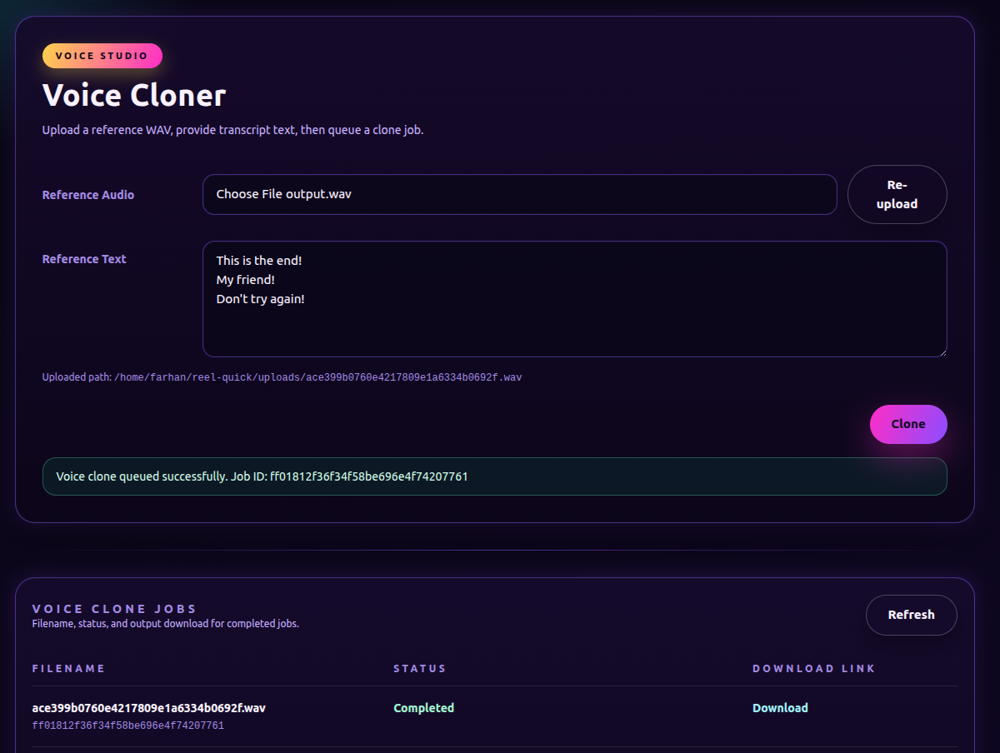

# Reel Quick


This repository provides an **open-source, end-to-end solution for fast and effortless Instagram Reel creation**. It enables you to upload video clips, trim them, and seamlessly merge multiple segments into a single, high-quality reel—perfect for creating engaging short-form content.

The project is designed with **performance, simplicity, and automation** in mind. There are **no accounts, logins, or credentials required**, making it ideal for developers, content creators, and automation workflows.

### ✨ Key Features

* Upload, trim, and merge multiple video files
* Fast, asynchronous video processing
* Clean web-based interface for reel creation
* No authentication or third-party dependencies
* Completely free and open source

### 🛠️ Tech Stack

* **Python 3.10+** – backend and processing logic
* **Uvicorn** – high-performance ASGI web server
* **Next.js** – modern frontend framework
* **ARQ (Async Redis Queue)** – background video processing
* **FFmpeg / FFprobe** – video manipulation and metadata inspection

### 🆓 License

This project is **free to use**, modify, and extend under an open-source license.

## 💡 Why I Created This Repository

I’m a **backend developer and DevOps engineer**, and I run a motivation-themed Instagram page (**@motivation_nitrous**). Creating content for the page typically involves stitching together multiple video clips to produce short, engaging reels.

Initially, I handled this workflow using **JSON configuration files in VS Code**. While functional, the process quickly became **time-consuming and inefficient**. Each reel required manually selecting files, copying paths, editing JSON structures, and fine-tuning scene boundaries to get the desired result. As content volume grew, this approach no longer scaled.

This repository was created to **automate and streamline the reel-creation workflow**, replacing repetitive manual steps with a faster, more intuitive system—without sacrificing flexibility or control.

---

## Prerequisite Software Installation

### Backend Installation

1. Install mongodb

```
sudo apt update
sudo apt install -y curl gnupg

# Import the GPG key
curl -fsSL https://www.mongodb.org/static/pgp/server-8.0.asc | \
   sudo gpg -o /usr/share/keyrings/mongodb-server-8.0.gpg \
   --dearmor
# Add the repo to the list

echo "deb [ arch=amd64,arm64 signed-by=/usr/share/keyrings/mongodb-server-8.0.gpg ] https://repo.mongodb.org/apt/ubuntu noble/mongodb-org/8.0 multiverse" | sudo tee /etc/apt/sources.list.d/mongodb-org-8.0.list

sudo apt update
sudo apt install -y mongodb-org

# Start the mongo service

sudo systemctl start mongod

# Login into Mongo Using the following command:

mongosh

```

2. Install Redis
Install the Redis Server using the following command:

```
sudo apt install -y redis-server

# Confirm installation using the following command:

redis-cli

```

### Frontend Installation

1. Install the NodeJS

```
curl -o- https://raw.githubusercontent.com/nvm-sh/nvm/v0.40.3/install.sh | bash

source ~/.bashrc

nvm list-remote

nvm install lts/krypton
```

---

## 🚧 Current Status

*Update - Mar 11 2026*
- Created backend classes for Sound Designer (it allows you create custom voices for your videos)
- Created RESTAPI Methods for sound designer
- Created NextJS interfaces for Sound designer


*Update - Mar 8 2026*
- Updated code for creating Clone audio
- Interface was created
- Video for the interaction will be uploaded later this week


* 🚧 **Frontend wiring for Sound Designer** — API Wired. Need to create the Background worker to call model
* 🚧 **Frontend to display prominent figures and quotes** — On Hold
* ✅ **Backend API (FastAPI)** — completed
* ✅ **Frontend (Next.js)** — core video creation workflow implemented
* ✅ **Background Worker (ARQ-based)** — currently under active development

---

## Latest Screenshots






[Download Generated Voice Clone](docs/ff01812f36f34f58be696e4f74207761.wav)

---

## 🗺️ Roadmap

Planned features and enhancements include:

* Mechanism to create custom voice by uploading a sample voice clip
* Bulk video creation from a single directory or input path
* ~~Support for **image-based posts** (static Instagram content)~~  **DONE**
* ~~GPT-powered text generation for Instagram image posts (via API key)~~ **DONE**
* Custom video transitions and effects between scenes
* In-browser image editing tools (crop, rotate, annotate, filters)
* Webhook support for automation and external integrations


## Prerequisites (Ubuntu/Debian)

```bash
sudo apt update
sudo apt install -y python3 python3-venv python3-pip ffmpeg redis-server
```

MongoDB server is required for the `instagram_reel_creator` database.

## Environment

Sample environment file exists in the repo's root location. Please rename **sample.env** to **.env**. 

```
MONGODB_URI=mongodb://localhost:27017
LOG_LOCATION=./llogs/reel_quick.log
REDIS_URL=redis://localhost:6379/1
OUTPUT_FILES_LOCATION=./outputs
```

# Backend 

## Backend technology

- **Python 3.10+**: primary backend language and video-processing logic.
- **FastAPI**: REST API framework in `backend/main.py`.
- **Uvicorn**: ASGI server used to run FastAPI.
- **MongoDB (pymongo)**: persistence for videos and video parts.
- **Redis + ARQ**: background job queue for video processing.
- **FFmpeg / FFprobe**: system binaries for media inspection and concatenation.
- **MoviePy**: Python-level video trimming and processing in `backend/objects/video_automation.py`.

## Why we selected this technology (rationale)

- **Python** enables fast iteration and strong ecosystem support for media tooling.
- **FastAPI** provides validation (Pydantic), async-friendly endpoints, and built-in OpenAPI docs.
- **MongoDB** offers a flexible document model for video and video-part metadata.
- **Redis + ARQ** keep long-running processing off the web request thread.
- **FFmpeg/FFprobe** are the most reliable, widely supported CLI tools for media inspection and muxing.
- **MoviePy** offers a Python-native API for clip trimming and effects while still using FFmpeg under the hood.

## Key prerequisites (system + services)

- **Python 3.10+**
- **FFmpeg** (must include `ffprobe` and support `libx264`)
- **MongoDB** server running (default `mongodb://localhost:27017`)
- **Redis** server running (default `redis://localhost:6379/0`)
- Sufficient disk space for uploads, temp segments, and output files.
- Environment variables (see below) set in `.env`.

### Required/expected environment variables

- `MONGODB_URI` – MongoDB connection string.
- `REDIS_URL` – Redis connection string.
- `LOG_LOCATION` – log file path for the backend logger.
- `UPLOAD_FILES_LOCATION` – filesystem path where uploads are stored (used by `/uploads`).
- `OUTPUT_FILES_LOCATION` – filesystem path for final output files.
- `INPUT_FILES_LOCATION` – base input directory used by `VideoAutomation`.

## Key PyPI libraries

- `fastapi` – API framework.
- `uvicorn` – ASGI server.
- `pymongo` – MongoDB driver.
- `arq` – Redis-based background job queue.
- `python-dotenv` – `.env` loading.
- `python-multipart` – upload handling for `/uploads`.
- `moviepy` – video trimming, effects, and export.
- `pydantic` – request/response models (installed via FastAPI).
- `typing-extensions` – used for `Annotated` in models (transitive dependency, but imported directly).

## Requirements.txt status

`requirements.txt` includes the core dependencies:
`pymongo`, `fastapi`, `python-multipart`, `uvicorn`, `python-dotenv`, `arq`, `moviepy`.

Additional libraries are used indirectly or imported directly:
- `pydantic` (FastAPI dependency)
- `typing-extensions` (imported in `video_part_model.py`)
- `redis` (ARQ dependency)


## Run the API

```bash
pip install -r requirements.txt

uvicorn main:app --reload --app-dir backend
```

## Run the worker

```bash
cd /usr/local/development/instagram-reel-creation
```


```bash
arq backend.workers.video_maker.WorkerSettings
```


### Complete Backend API documentation

Access Swagger documentations using: http://127.0.0.1:8000/docs (provided by FastAPI)

## Sample cURL

Create a video:

```bash
curl -X POST http://127.0.0.1:8000/videos \
  -H "Content-Type: application/json" \
  -d '{
    "video_title": "My first reel",
    "video_introduction": "Short intro",
    "video_tags": ["travel", "daily"],
    "active": true
  }'
```

List videos:

```bash
curl -X GET http://127.0.0.1:8000/videos
```


# Frontend 

## Frontend technology

- **Next.js 16 (App Router)** – React framework and routing in `frontend/app`.
- **React 19** – UI rendering.
- **TypeScript** – type safety in `.tsx` components.
- **Tailwind CSS v4** – utility styling via `@import "tailwindcss";` in `frontend/app/globals.css`.
- **Next/font (Google fonts)** – Space Grotesk and Oxanium loaded in `frontend/app/layout.tsx`.
- **ESLint** – linting with `eslint-config-next`.

## Why we selected this technology (rationale)

- **Next.js** provides fast local dev, built-in routing, image optimization, and production-ready builds.
- **React** gives a composable UI model for the video workflow screens.
- **TypeScript** reduces runtime errors in a state-heavy UI (file uploads, timelines, and queues).
- **Tailwind** speeds up UI iteration and enables a consistent design system in CSS.

## Key prerequisites (system + tooling)

- **Node.js (LTS recommended)** and **npm** (or pnpm/yarn/bun).
- Backend API running and reachable (default `http://127.0.0.1:8000`).
- A `.env` or local environment variable for `NEXT_PUBLIC_API_BASE_URL` if the backend is not local.

### Required/expected environment variables

- `NEXT_PUBLIC_API_BASE_URL` – base URL for the backend API.
  - Default fallback in the code: `http://127.0.0.1:8000`.

## Key npm packages

Runtime dependencies in `frontend/package.json`:
- `next`
- `react`
- `react-dom`

Dev dependencies (tooling):
- `typescript`
- `eslint`, `eslint-config-next`
- `tailwindcss`, `@tailwindcss/postcss`
- `@types/node`, `@types/react`, `@types/react-dom`

## package.json status

`frontend/package.json` matches what is imported in the codebase:
- Next.js/React/TypeScript are used directly.
- Tailwind is configured via PostCSS and used in `globals.css`.
- No additional runtime libraries are referenced in the UI code.

## Frontend routes and API calls

### Routes

- `/` – marketing/overview page (`frontend/app/page.tsx`).
- `/create_video` – reel creation workflow (`frontend/app/create_video/page.tsx`).

### API calls used by the frontend

All API calls are made from `/create_video`:

- `POST /uploads` – upload video files (multipart form).
- `POST /videos` – create a video record.
- `POST /video-parts` – create video parts for the reel.
- `POST /videos/{video_id}/enqueue` – enqueue the video for background processing.