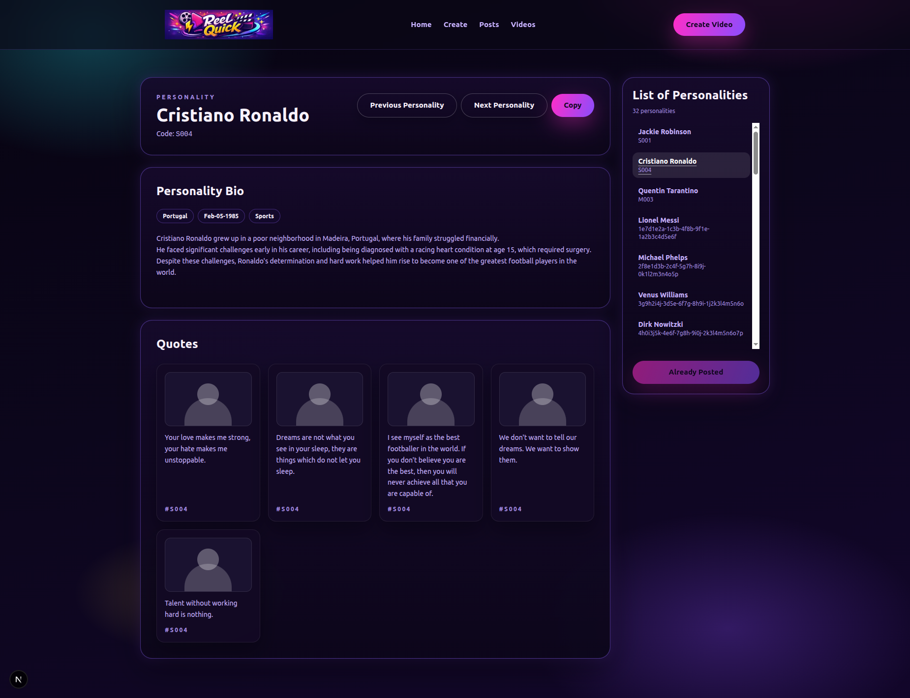
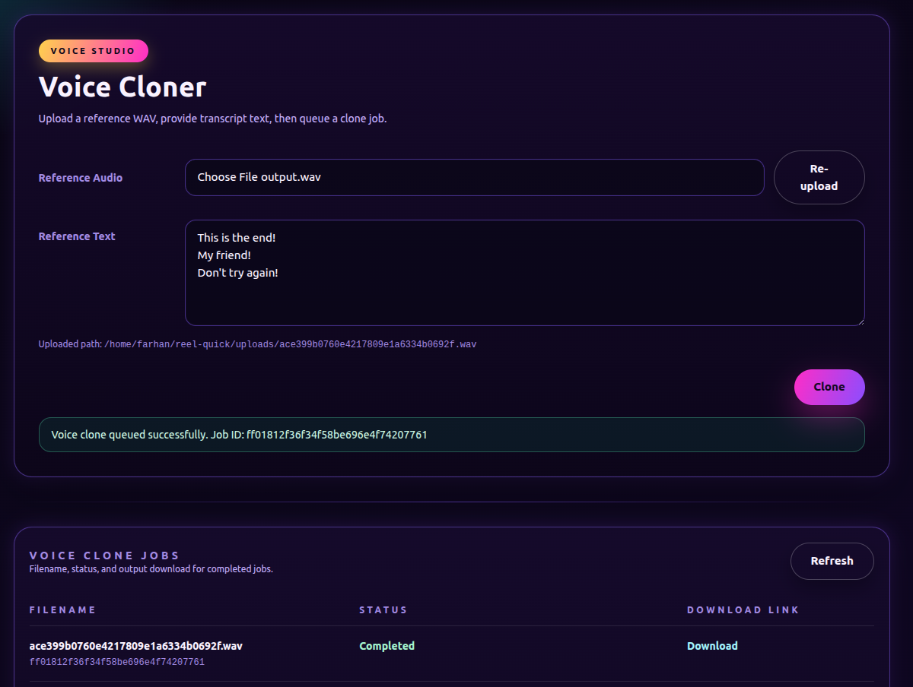
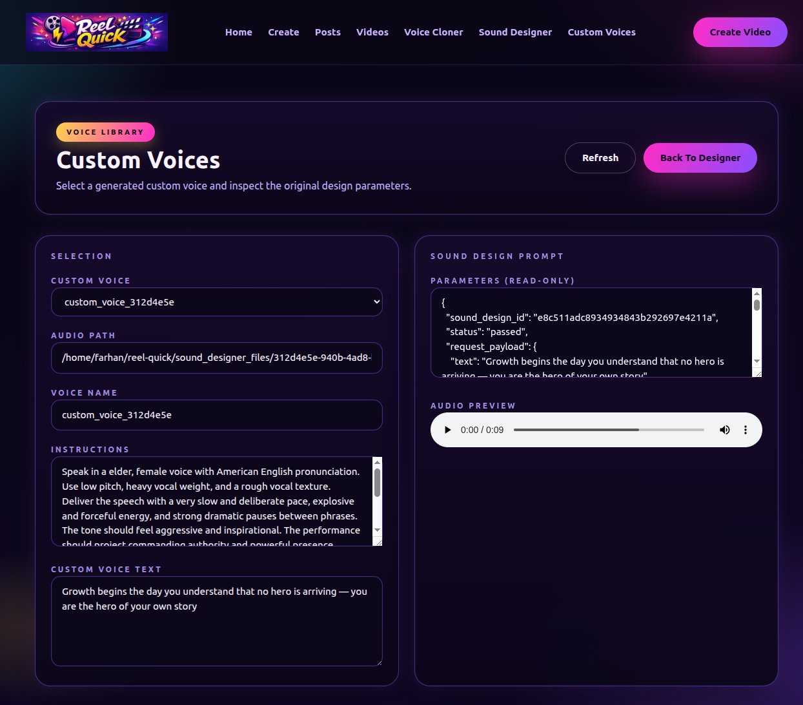
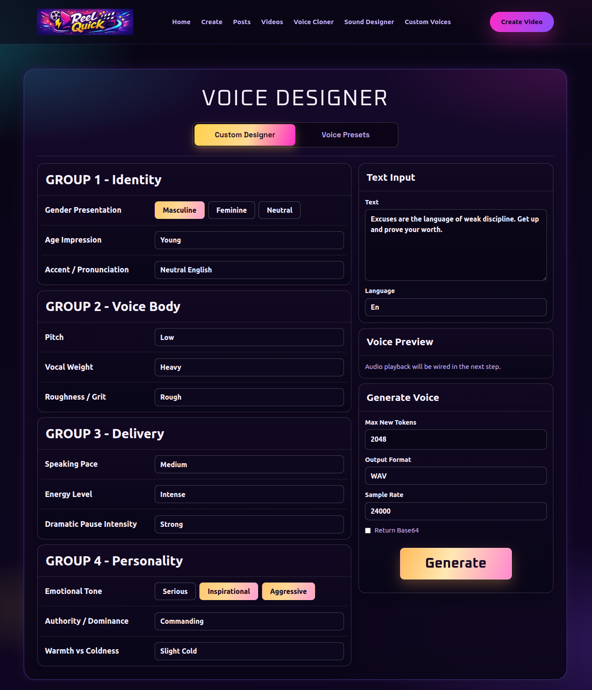
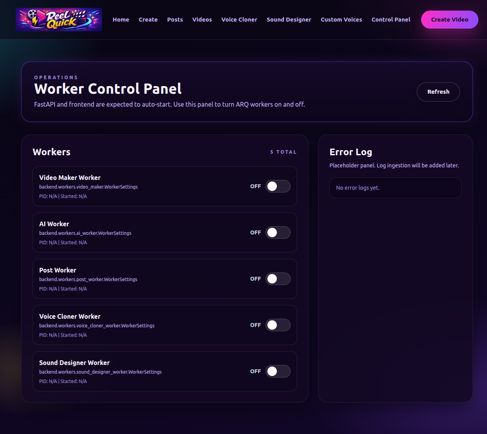
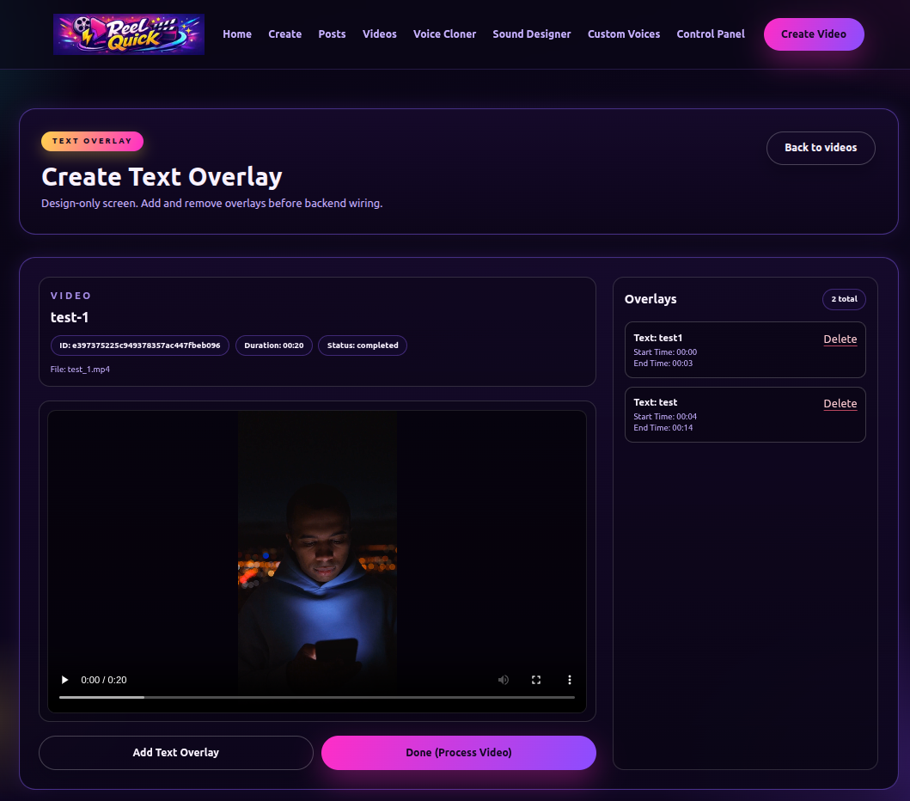
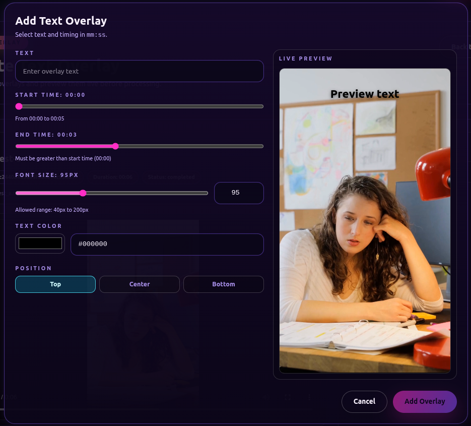

# Reel Quick

### Open-source automation platform for creating Instagram Reels, TikTok videos and YouTube Shorts


🚀 **Reel Quick** helps creators and developers turn video clips into polished short-form
videos using trimming, stitching, text overlays, voice tools, themes and transitions.

Built with FastAPI, Next.js, Redis/ARQ and FFmpeg.

Self-hosted • No login required • Developer-friendly • MIT licensed

## 🎬 Demo

<p align="center">
  
</p>


---

## ✨ Features

🎬 **Reel Creator**
Trim, arrange and merge multiple video clips into short-form videos.

📝 **Text Overlays**
Add customizable text and captions directly to generated videos.

🎙️ **Voice Tools**
Create and integrate custom voice/audio content into videos.

🎞️ **Video Transitions**
Add FFmpeg-powered transitions between scenes.

🎨 **Themes**
Apply reusable visual styles to video projects.

⚡ **Async Rendering**
Redis + ARQ workers handle long-running video processing outside API requests.

🖥️ **Web Interface**
Manage video workflows through a Next.js frontend.

🔌 **REST API**
Automate video generation using FastAPI endpoints.

🛠️ **Worker Control Panel**
Monitor and control background processing services.

🏠 **Self-hosted**
Run the complete video generation stack on your own infrastructure.

### 🛠️ Tech Stack

* **Python 3.10+** – backend and processing logic
* **Uvicorn** – high-performance ASGI web server
* **Next.js** – modern frontend framework
* **ARQ (Async Redis Queue)** – background video processing
* **FFmpeg / FFprobe** – video manipulation and metadata inspection

### 🆓 License

This project is **free to use**, modify, and extend under an open-source license.

## 👥 Who Is Reel Quick For?

### Content Creators
Create repeatable short-form content without manually editing every video.

### Developers
Build custom social-video workflows on top of an open-source FastAPI backend.

### Social Media Agencies
Automate repetitive editing and rendering workflows for multiple campaigns.

### Automation Builders
Integrate video rendering into agents, workflows, scripts and external applications.

### Open-source Contributors
Experiment with FFmpeg, Python video processing and modern async architectures.

## 💡 Why I Created This Repository

I’m a **backend developer and DevOps engineer**, and I run a motivation-themed Instagram page (**@motivation_nitrous**). Creating content for the page typically involves stitching together multiple video clips to produce short, engaging reels.

Initially, I handled this workflow using **JSON configuration files in VS Code**. While functional, the process quickly became **time-consuming and inefficient**. Each reel required manually selecting files, copying paths, editing JSON structures, and fine-tuning scene boundaries to get the desired result. As content volume grew, this approach no longer scaled.

This repository was created to **automate and streamline the reel-creation workflow**, replacing repetitive manual steps with a faster, more intuitive system—without sacrificing flexibility or control.

---
## Architecture

                 ┌────────────────┐
                 │ Next.js UI     │
                 └───────┬────────┘
                         │
                         ▼
                 ┌────────────────┐
                 │ FastAPI API    │
                 └───────┬────────┘
                         │
              ┌──────────┴─────────┐
              ▼                    ▼
        ┌──────────┐         ┌──────────┐
        │ MongoDB  │         │ Redis    │
        └──────────┘         └────┬─────┘
                                  │
                         ┌────────▼────────┐
                         │ ARQ Workers     │
                         └────────┬────────┘
                                  │
                                  ▼
                         ┌─────────────────┐
                         │ FFmpeg/MoviePy  │
                         └────────┬────────┘
                                  │
                                  ▼
                           Generated Reel

---

## Easy Startup Commands

For easy start and managing components, we have created systemd services for Linux / Ubuntu / Debian.

Please check folder named **systemd_scripts** for systemd scripts for following four services.

### Reel Quick Backend

```bash
sudo systemctl start reel-quick-backend
sudo systemctl restart reel-quick-backend
systemctl status reel-quick-backend
```

### Reel Quick Frontend

```bash
sudo systemctl start reel-quick-frontend
sudo systemctl restart reel-quick-frontend
systemctl status reel-quick-frontend
```

### Reel Quick Video Worker

```bash
sudo systemctl start reel-quick-video-worker
sudo systemctl restart reel-quick-video-worker
systemctl status reel-quick-video-worker
```

### Reel Quick Text Overlay Worker

```bash
sudo systemctl start reel-quick-text-overlay-worker
sudo systemctl restart reel-quick-text-overlay-worker
systemctl status reel-quick-text-overlay-worker
```

## Prerequisite Software Installation

### Backend Installation

1. Install mongodb

```
sudo apt update
sudo apt install -y curl gnupg

# Import the GPG key
curl -fsSL https://www.mongodb.org/static/pgp/server-8.0.asc | \
   sudo gpg -o /usr/share/keyrings/mongodb-server-8.0.gpg \
   --dearmor
# Add the repo to the list

echo "deb [ arch=amd64,arm64 signed-by=/usr/share/keyrings/mongodb-server-8.0.gpg ] https://repo.mongodb.org/apt/ubuntu noble/mongodb-org/8.0 multiverse" | sudo tee /etc/apt/sources.list.d/mongodb-org-8.0.list

sudo apt update
sudo apt install -y mongodb-org

# Start the mongo service

sudo systemctl start mongod

# Login into Mongo Using the following command:

mongosh

```

2. Install Redis
Install the Redis Server using the following command:

```
sudo apt install -y redis-server

# Confirm installation using the following command:

redis-cli

```

### Frontend Installation

1. Install the NodeJS

```
curl -o- https://raw.githubusercontent.com/nvm-sh/nvm/v0.40.3/install.sh | bash

source ~/.bashrc

nvm list-remote

nvm install lts/krypton
```

---

## 🚧 Current Status

*Update - Jul 11 2026*
- **Added Video Transition Effects**
- Added sample transition input clips: [clip-1.mp4](docs/clip-1.mp4), [clip-2.mp4](docs/clip-2.mp4)
- Added sample output video with circle transition: [testing_transitions.mp4](docs/testing_transitions.mp4)
- **Added Theme Selector**
- Added theme selector demo output video: [theme_selector.mp4](docs/theme_selector.mp4)

*Update - Apr 10 2026*
- Finished frontend component for adding video text overlay
- Finished the backend component for adding video text overlay

*Update - Mar 19 2026*
- Completed the wiring the control panel
- Using the control panel you turn on and off backend workers

*Update - Mar 14 2026*
- Completed the frontend development for custom voice designer
- Completed backend API 
- Completed backend Worker
- Updated README.md

*Update - Mar 11 2026*
- Created backend classes for Sound Designer (it allows you create custom voices for your videos)
- Created RESTAPI Methods for sound designer
- Created NextJS interfaces for Sound designer


*Update - Mar 8 2026*
- Updated code for creating Clone audio
- Interface was created
- Video for the interaction will be uploaded later this week

* 🔎 **Docker container - for easier setup** - Scoped
* 🔎 **Streaming stats about the running workers and what they are processing** - Scoped
* 🔎 **Add functionality to logs for each worker in the control panel** — Scoped
* ✅ **Added Voice Cloner Component** — Completed
* ✅ **Added Video text overlay creator** — Completed
* ✅ **Added Video reels creator** — Completed
* ✅ **Added Control panel to start/stop workers** — Completed
* ✅ **Frontend wiring for Sound Designer** — Completed
* 🚧 **Frontend to display prominent figures and quotes** — On Hold
* ✅ **Backend API (FastAPI)** — Completed
* ✅ **Frontend (Next.js)** — Completed
* ✅ **Background Worker (ARQ-based)** — Completed

---

## Latest Screenshots






[Download Generated Voice Clone](docs/ff01812f36f34f58be696e4f74207761.wav)












---

## 🗺️ Roadmap

Planned features and enhancements include:

* ~~Mechanism to create custom voice by uploading a sample voice clip~~
* Bulk video creation from a single directory or input path
* ~~Support for **image-based posts** (static Instagram content)~~  **DONE**
* ~~GPT-powered text generation for Instagram image posts (via API key)~~ **DONE**
* Custom video transitions and effects between scenes
* In-browser image editing tools (crop, rotate, annotate, filters)
* Webhook support for automation and external integrations


## Prerequisites (Ubuntu/Debian)

```bash
sudo apt update
sudo apt install -y python3 python3-venv python3-pip ffmpeg redis-server
```

MongoDB server is required for the `instagram_reel_creator` database.

If you want scene transitions, your local `ffmpeg` must support the `xfade` filter.
Verify it with:

```bash
ffmpeg -hide_banner -h filter=xfade
```

If the command prints the `xfade` filter and transition options, transition stitching is available on that machine. Supported transition names depend on the local `ffmpeg` build.

## Environment

Sample environment file exists in the repo's root location. Please rename **sample.env** to **.env**. 

```
MONGODB_URI=mongodb://localhost:27017
LOG_LOCATION=./llogs/reel_quick.log
REDIS_URL=redis://localhost:6379/1
OUTPUT_FILES_LOCATION=./outputs
```

# Backend 

## Backend technology

- **Python 3.10+**: primary backend language and video-processing logic.
- **FastAPI**: REST API framework in `backend/main.py`.
- **Uvicorn**: ASGI server used to run FastAPI.
- **MongoDB (pymongo)**: persistence for videos and video parts.
- **Redis + ARQ**: background job queue for video processing.
- **FFmpeg / FFprobe**: system binaries for media inspection and concatenation.
- **MoviePy**: Python-level video trimming and processing in `backend/objects/video_automation.py`.

## Why we selected this technology (rationale)

- **Python** enables fast iteration and strong ecosystem support for media tooling.
- **FastAPI** provides validation (Pydantic), async-friendly endpoints, and built-in OpenAPI docs.
- **MongoDB** offers a flexible document model for video and video-part metadata.
- **Redis + ARQ** keep long-running processing off the web request thread.
- **FFmpeg/FFprobe** are the most reliable, widely supported CLI tools for media inspection and muxing.
- **MoviePy** offers a Python-native API for clip trimming and effects while still using FFmpeg under the hood.

## Key prerequisites (system + services)

- **Python 3.10+**
- **FFmpeg** (must include `ffprobe`, support `libx264`, and support `xfade` for scene transitions)
- **MongoDB** server running (default `mongodb://localhost:27017`)
- **Redis** server running (default `redis://localhost:6379/0`)
- Sufficient disk space for uploads, temp segments, and output files.
- Environment variables (see below) set in `.env`.

Check transition support locally with:

```bash
ffmpeg -hide_banner -h filter=xfade
```

### Required/expected environment variables

- `MONGODB_URI` – MongoDB connection string.
- `REDIS_URL` – Redis connection string.
- `LOG_LOCATION` – log file path for the backend logger.
- `UPLOAD_FILES_LOCATION` – filesystem path where uploads are stored (used by `/uploads`).
- `OUTPUT_FILES_LOCATION` – filesystem path for final output files.
- `INPUT_FILES_LOCATION` – base input directory used by `VideoAutomation`.

## Key PyPI libraries

- `fastapi` – API framework.
- `uvicorn` – ASGI server.
- `pymongo` – MongoDB driver.
- `arq` – Redis-based background job queue.
- `python-dotenv` – `.env` loading.
- `python-multipart` – upload handling for `/uploads`.
- `moviepy` – video trimming, effects, and export.
- `pydantic` – request/response models (installed via FastAPI).
- `typing-extensions` – used for `Annotated` in models (transitive dependency, but imported directly).

## Requirements.txt status

`requirements.txt` includes the core dependencies:
`pymongo`, `fastapi`, `python-multipart`, `uvicorn`, `python-dotenv`, `arq`, `moviepy`.

Additional libraries are used indirectly or imported directly:
- `pydantic` (FastAPI dependency)
- `typing-extensions` (imported in `video_part_model.py`)
- `redis` (ARQ dependency)


## Run the API

```bash
pip install -r requirements.txt

uvicorn main:app --reload --app-dir backend
```

## Run the worker

```bash
cd /usr/local/development/instagram-reel-creation
```


```bash
arq backend.workers.video_maker.WorkerSettings
```


### Complete Backend API documentation

Access Swagger documentations using: http://127.0.0.1:8000/docs (provided by FastAPI)

## Sample cURL

Create a video:

```bash
curl -X POST http://127.0.0.1:8000/videos \
  -H "Content-Type: application/json" \
  -d '{
    "video_title": "My first reel",
    "video_introduction": "Short intro",
    "video_tags": ["travel", "daily"],
    "active": true
  }'
```

List videos:

```bash
curl -X GET http://127.0.0.1:8000/videos
```


# Frontend 

## Frontend technology

- **Next.js 16 (App Router)** – React framework and routing in `frontend/app`.
- **React 19** – UI rendering.
- **TypeScript** – type safety in `.tsx` components.
- **Tailwind CSS v4** – utility styling via `@import "tailwindcss";` in `frontend/app/globals.css`.
- **Next/font (Google fonts)** – Space Grotesk and Oxanium loaded in `frontend/app/layout.tsx`.
- **ESLint** – linting with `eslint-config-next`.

## Why we selected this technology (rationale)

- **Next.js** provides fast local dev, built-in routing, image optimization, and production-ready builds.
- **React** gives a composable UI model for the video workflow screens.
- **TypeScript** reduces runtime errors in a state-heavy UI (file uploads, timelines, and queues).
- **Tailwind** speeds up UI iteration and enables a consistent design system in CSS.

## Key prerequisites (system + tooling)

- **Node.js (LTS recommended)** and **npm** (or pnpm/yarn/bun).
- Backend API running and reachable (default `http://127.0.0.1:8000`).
- A `.env` or local environment variable for `NEXT_PUBLIC_API_BASE_URL` if the backend is not local.

### Required/expected environment variables

- `NEXT_PUBLIC_API_BASE_URL` – base URL for the backend API.
  - Default fallback in the code: `http://127.0.0.1:8000`.

## Key npm packages

Runtime dependencies in `frontend/package.json`:
- `next`
- `react`
- `react-dom`

Dev dependencies (tooling):
- `typescript`
- `eslint`, `eslint-config-next`
- `tailwindcss`, `@tailwindcss/postcss`
- `@types/node`, `@types/react`, `@types/react-dom`

## package.json status

`frontend/package.json` matches what is imported in the codebase:
- Next.js/React/TypeScript are used directly.
- Tailwind is configured via PostCSS and used in `globals.css`.
- No additional runtime libraries are referenced in the UI code.

## Frontend routes and API calls

### Routes

- `/` – marketing/overview page (`frontend/app/page.tsx`).
- `/create_video` – reel creation workflow (`frontend/app/create_video/page.tsx`).

### API calls used by the frontend

All API calls are made from `/create_video`:

- `POST /uploads` – upload video files (multipart form).
- `POST /videos` – create a video record.
- `POST /video-parts` – create video parts for the reel.
- `POST /videos/{video_id}/enqueue` – enqueue the video for background processing.
